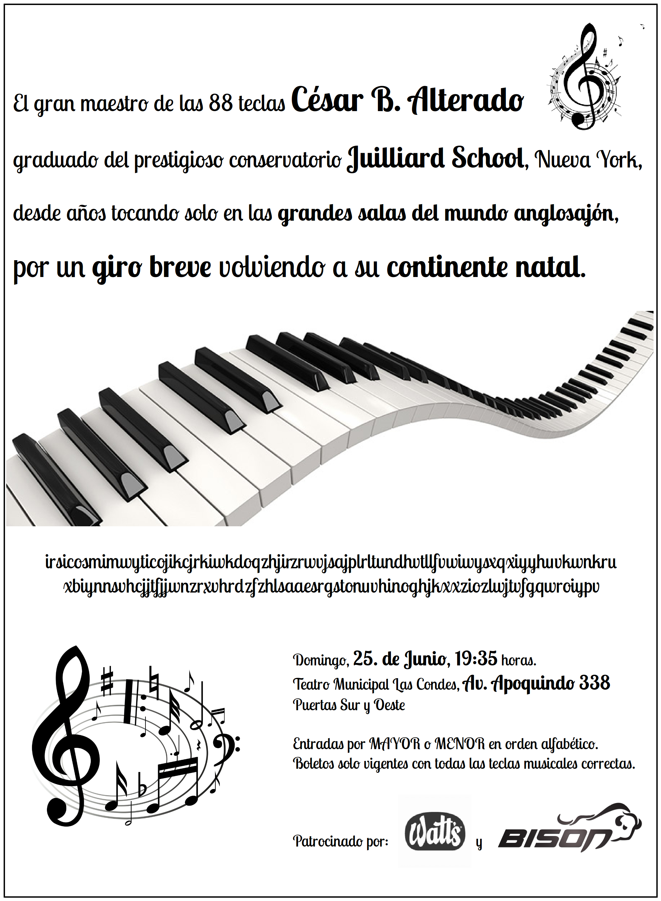

# Metro 10: El cifrado del pianista

## Descripción del geocaché:

La semana pasada, en un día totalmente sin sol, cruzando la estación de Metro El Golf vi un curioso cartel de diseño puramente blanco y negro anunciando el único concierto del famoso pianista César B. Alterado en Santiago. Parece que el pianista mandó un mensaje particular cifrado a sus fanáticos más fieles.

Nota: Yendo en el Metro de Santiago a menudo veo gente resolviendo crucigramas, sudokus, sopas de letras y varios otros tipos de rompecabezas. Así pensé en armar una serie de cachés de misterio con acertijos que se pueden trabajar durante un viaje (en otro caso aburrido) de metro. Es el décimo caché de esa serie, que se continuará durante los próximos meses. Las coordenadas publicadas son para la estación del Metro El Golf (Línea uno), cerca del Teatro Municipal Las Condes, donde César tocará su concierto de piano.

Sin embargo el contenedor físico de este caché se esconde en otro lugar, pero como habitual, se encuentra a menos de 3km de distancia de las coordenadas publicadas. Cuidado con los muggles que probablemente andan por allí durante el día. Trate de evitar ser visto al recuperar y reemplazar el recipiente.

### Pista Adicional

[ES] su clasico "Nada de mi, sin sol!" con un toque progresivo, al final mejor tocándolo a cuatro manos 